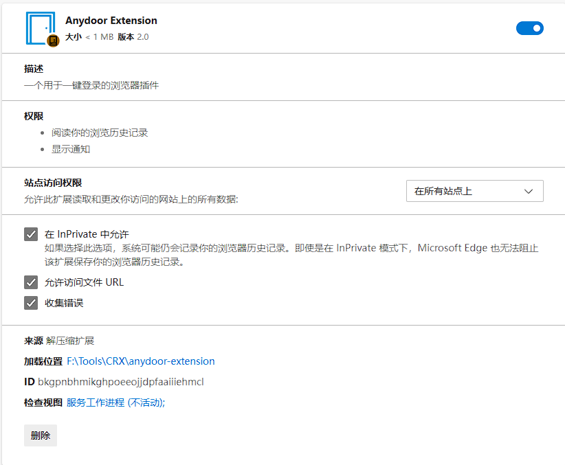
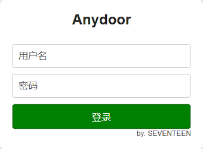
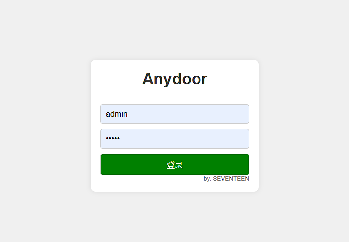
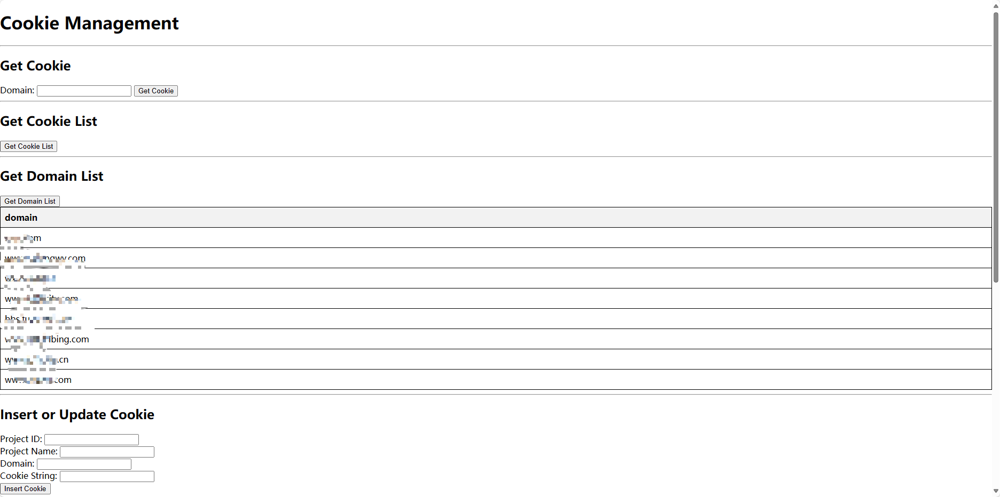

# Anydoor

基于Spring Boot的Cookie管理服务,实现Cookie的上传与下载.

## 背景

由于经常切换工作环境,账号端之前需要反复的登录.所以想给Cookie上传进行管理,通过插件再将Cookie写入到浏览器中实现登录操作

## 环境

 后端 : Spring Boot 3 + Sa-Token + MyBatisPlus 3.5 + mysql 8.0 + druid +jdk22

前端 :   基于 Manifest V3 协议的 CRX 插件

管理端地址:  https://localhost/loginPage

## 页面

### 插件



登陆页面



主页面


### 管理端

登陆页面



主页面




## 已完成功能

### 前端

- 完成CRX插件的登录/登出
- 完成Cookie的下载/上传

### 后端

- 完成Cookie的管理
- 完成User的管理
- 完成用户的角色管理

## 待完成功能

- 任务的发布与管理(自动更新指定域名的Cookie,无需人工介入维护Cookie)
- OAuth2.0 接入
- Cookie与User之间的数据隔离
- 单一域名下多Cookie之间的切换,实现多账号切换
- 后端管理页面的优化
- 添加权限设置,细分鉴权

## 部署步骤

### 数据库部署

在Mysql8服务器中部署 : anydoor-sql/anydoor.sql

注意初始化管理员账号密码: admin /admin

### 服务端部署

使用IDE打开并编译: anydoor-jar

在此你可能需要了解一些架构上的知识


修改数据库链接地址: anydoor-jar/src/main/resources/application.yml 

```yaml
    driver-class-name: com.mysql.cj.jdbc.Driver
    url: jdbc:mysql://localhost:3306/anydoor?useSSL=false&useUnicode=true&characterEncoding=UTF-8&serverTimezone=Asia/Shanghai
```

如果同一台服务器则无需修改

### 前端部署

Chromium内核浏览器,插件 > 打开开发者模式 > 选择anydoor-crx

在此之前你需要修改: anydoor-crx/script/background.js

```js
// 定义服务器地址
const serverURL = "http://localhost"; //修改为后端服务器地址
```

